# Conceptual ERD

This document provides a complete conceptual ERD for the ISP Billing, CRM, Monitoring, and Operations platform.

## Scope
- Source aligned with architecture decisions, glossary, and business entity inventory.
- Conceptual model only.
- No SQL, no physical column definitions.

## Legend
- `1` means exactly one.
- `0..1` means optional one.
- `N` means many.
- Deletion behavior keywords: Restrict, Soft Delete, Cascade, Archive.

# Identity & Access

## Mermaid ERD

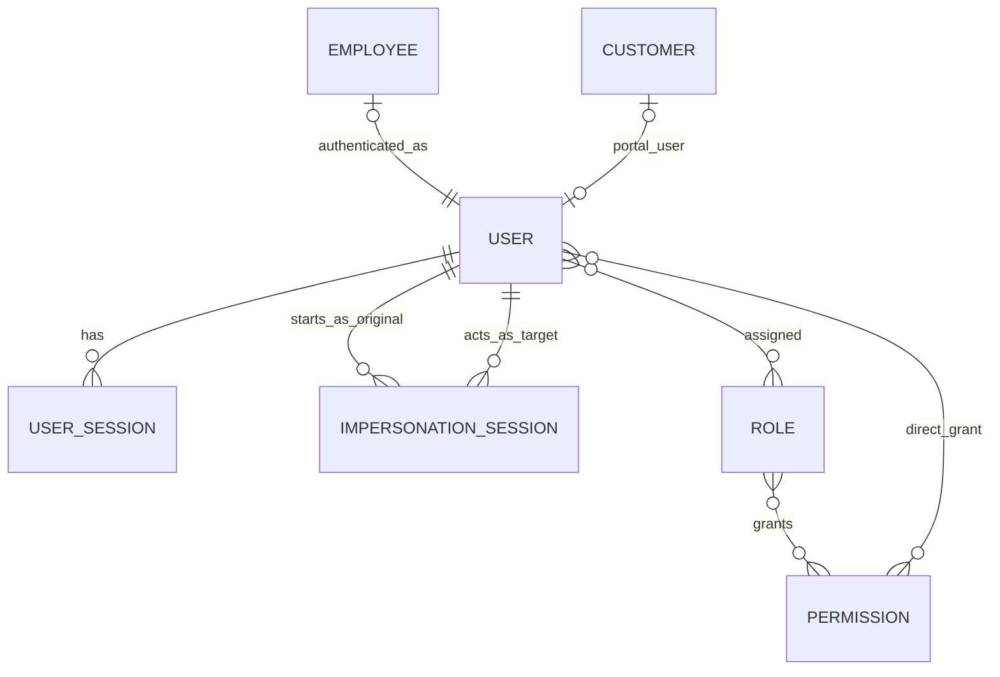

## Relationship Explanations
- User (1) -> (N) UserSession
- User (1) -> (N) ImpersonationSession as original actor
- User (1) -> (N) ImpersonationSession as impersonated target
- User (N) -> (N) Role
- Role (N) -> (N) Permission
- User (N) -> (N) Permission for direct grants
- Employee (1) -> (1) User (every employee has exactly one user account)
- Customer (0..1) -> (1) User (customer may have a portal user account)

## Ownership Rules
- UserSession belongs to User.
- ImpersonationSession belongs to both an original User and a target User.
- Role and Permission are shared identity governance entities.
- Employee holds a mandatory FK to User (user account required for all employees).
- Customer holds an optional FK to User (portal access is optional).

## Deletion Behavior
- User uses Soft Delete, with Restrict for linked financial or audit references.
- Role uses Restrict when assigned; otherwise Soft Delete.
- Permission uses Restrict when assigned.
- UserSession is Archive-oriented by retention policy.
- ImpersonationSession is Archive-only.

## Lifecycle Dependencies
- User must be Active before UserSession can be started.
- ImpersonationSession requires permission check before activation.
- Role and Permission must exist before User assignment.

# Customer Management

## Mermaid ERD

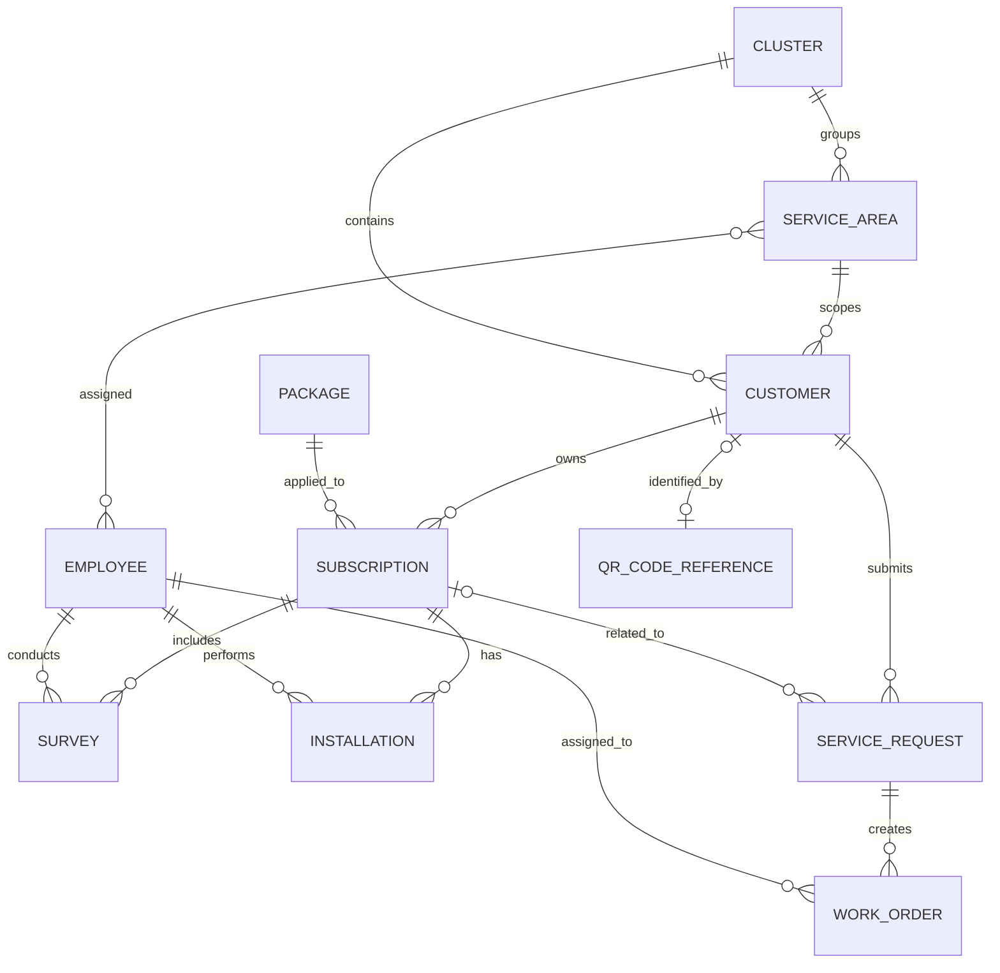

## Relationship Explanations
- Cluster (1) -> (N) ServiceArea
- ServiceArea (0..1) -> (N) ServiceArea (hierarchy via `parent_id`)
- ServiceArea (1) -> (N) Customer
- ServiceArea (N) -> (N) Employee
- Cluster (1) -> (N) Customer
- Customer (1) -> (N) Subscription
- Package (1) -> (N) Subscription
- Subscription (1) -> (N) Survey
- Subscription (1) -> (N) Installation
- Employee (1) -> (N) Survey (as assigned surveyor)
- Employee (1) -> (N) Installation (as assigned technician)
- Customer (1) -> (N) ServiceRequest
- Subscription (0..1) -> (N) ServiceRequest
- ServiceRequest (1) -> (N) WorkOrder
- Employee (1) -> (N) WorkOrder
- Customer (0..1) -> (1) QRCodeReference (generated on first Subscription activation; polymorphic Platform entity)

## Polymorphic Platform Relationships
The following polymorphic relationships exist on Customer but are not shown in the Mermaid diagram (they are cross-cutting platform concerns):
- Customer (1) -> (N) TimelineEvent (polymorphic via `timeline_eventable`)
- Customer (1) -> (N) ActivityLog (polymorphic via `loggable`)
- Customer (1) -> (N) Attachment (polymorphic via `attachable`)
- Customer (0..1) -> (1) User (optional portal account; FK `customers.user_id`)

## Ownership Rules
- Subscription belongs to Customer and Package.
- ServiceRequest belongs to Customer and may reference Subscription.
- WorkOrder belongs to ServiceRequest and assigned Employee.
- Customer belongs to one ServiceArea and one Cluster.
- ServiceArea belongs to one Cluster and may belong to one parent ServiceArea.
- Employee-to-ServiceArea assignment is implemented through the `employee_service_area` pivot table.
- QRCodeReference belongs to Customer (generated on Prospect → Active transition).
- Invoice belongs to Subscription and Customer (dual FK — intentional denormalization for Customer 360 performance).
- Payment belongs to Customer (direct FK — intentional denormalization for Customer 360 performance).

## Deletion Behavior
- Customer uses Soft Delete with pre-condition validation. Restrict when any Invoice with status `published`/`overdue`/`paid` exists, OR any Payment record exists, OR any active PaymentAllocation exists, OR any active Subscription exists, OR any open Ticket exists, OR any pending ServiceRequest exists. Draft Invoices do NOT trigger Restrict.
- Subscription uses Soft Delete for non-financial contexts, Restrict when invoices/payments exist.
- Cluster and ServiceArea use Soft Delete or Archive with Restrict on active dependencies.
- ServiceArea merge is modeled as terminal source state with self-reference to destination, not as delete-and-recreate.
- ServiceRequest uses Soft Delete and Archive after closure.
- WorkOrder uses Soft Delete or Archive after completion.

## Lifecycle Dependencies
- Customer must exist before Subscription.
- Customer status and Subscription status are orthogonal — they are evaluated independently.
- Active primary subscription uniqueness applies per customer (enforced at application layer with lockForUpdate).
- Customer Termination requires all Subscriptions to be in `terminated` state before the account can be closed.
- Customer Prospect → Active transition is triggered automatically by the first SubscriptionActivated event.
- Survey completion is required before Installation scheduling.
- Installation completion triggers ProvisioningRequest creation.
- ServiceRequest is required for customer-initiated change workflows.
- WorkOrder execution depends on approved ServiceRequest.

# Billing

## Mermaid ERD

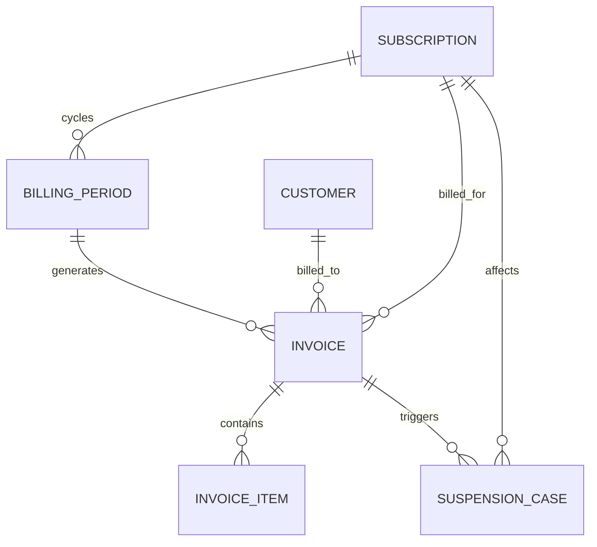

## Relationship Explanations
- Subscription (1) -> (N) BillingPeriod references
- BillingPeriod (1) -> (N) Invoice
- Customer (1) -> (N) Invoice
- Subscription (1) -> (N) Invoice
- Invoice (1) -> (N) InvoiceItem
- Invoice (1) -> (N) SuspensionCase
- Subscription (1) -> (N) SuspensionCase

## Ownership Rules
- Invoice belongs to Subscription and Customer.
- InvoiceItem belongs to Invoice.
- SuspensionCase belongs to Subscription and is triggered by Invoice aging.
- BillingPeriod owns cycle context for invoice generation.

## Deletion Behavior
- Invoice is Restrict and logically immutable; corrections via void/reversal.
- InvoiceItem is Restrict after issuance.
- BillingPeriod is Archive-oriented.
- SuspensionCase is Archive-only.

## Lifecycle Dependencies
- Subscription must be active before invoice generation.
- One invoice per subscription per billing period is mandatory.
- Invoice due date and overdue age drive SuspensionCase evaluation.
- On-demand invoice PDF generation depends on current invoice snapshot data.

# Payments

## Mermaid ERD

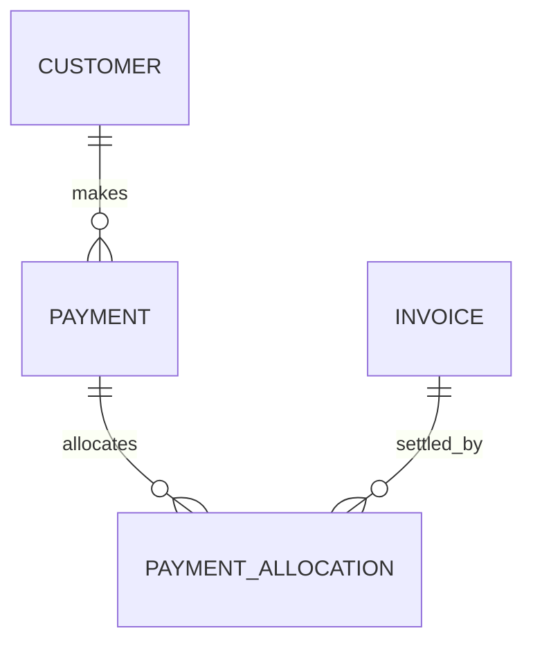

## Relationship Explanations
- Customer (1) -> (N) Payment
- Payment (1) -> (N) PaymentAllocation
- Invoice (1) -> (N) PaymentAllocation

## Ownership Rules
- Payment belongs to Customer.
- PaymentAllocation belongs to Payment and references Invoice.

## Deletion Behavior
- Payment is Restrict and logically immutable; correction through reversal.
- PaymentAllocation is Restrict for confirmed allocations.

## Lifecycle Dependencies
- Payment must exist before PaymentAllocation.
- Allocation cannot exceed payment remainder or invoice outstanding balance.
- Payment confirmation can trigger subscription reactivation evaluation.

# Provisioning

## Mermaid ERD

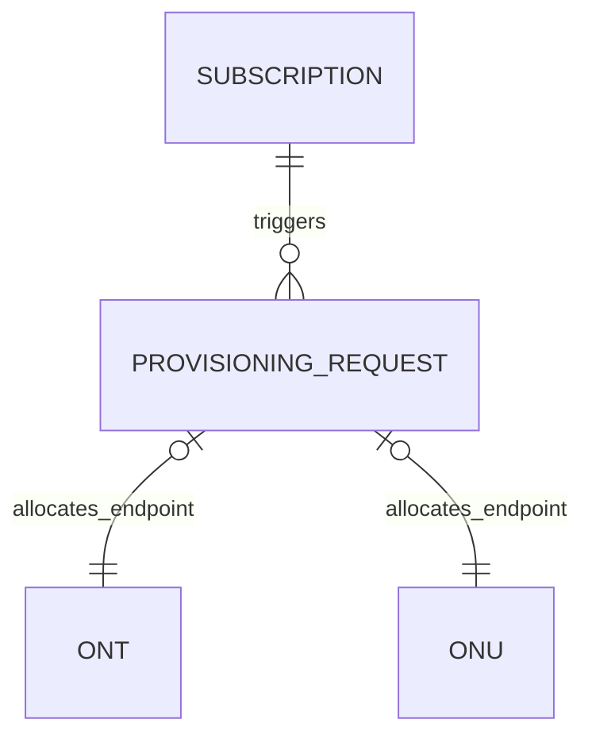

## Relationship Explanations
- Subscription (1) -> (N) ProvisioningRequest
- ProvisioningRequest (0..1) -> (1) ONT (allocated endpoint)
- ProvisioningRequest (0..1) -> (1) ONU (allocated endpoint)

## Ownership Rules
- ProvisioningRequest belongs to Subscription.
- Endpoint allocation references ONT or ONU but does not transfer ownership.

## Deletion Behavior
- ProvisioningRequest is Archive after subscription closure.
- StateTransitionLog entries are Archive-only.

## Lifecycle Dependencies
- Subscription must be in pre-activation state before ProvisioningRequest is created.
- Only one active ProvisioningRequest per Subscription at any time.
- Provisioning completion is required before subscription activation.
- StateTransitionLog records for ProvisioningRequest are managed through the polymorphic Audit platform entity; see the Audit section for the StateTransitionLog ERD.

# Collector

## Mermaid ERD

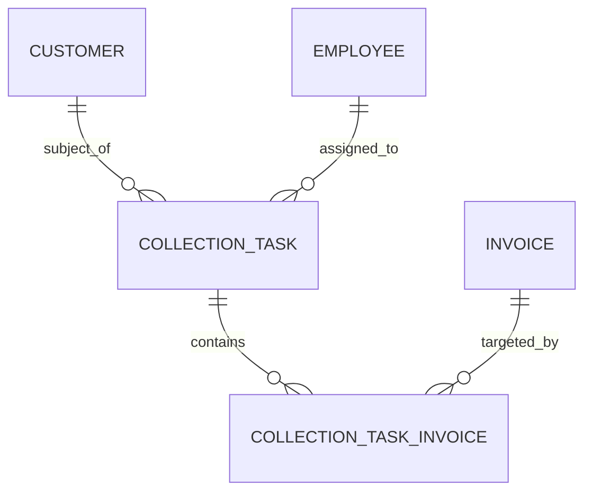

## Relationship Explanations
- Customer (1) -> (N) CollectionTask
- Employee (1) -> (N) CollectionTask (as assigned collector)
- CollectionTask (1) -> (N) CollectionTaskInvoice
- Invoice (1) -> (N) CollectionTaskInvoice

## Ownership Rules
- CollectionTask belongs to Customer and assigned Employee.
- CollectionTaskInvoice belongs to CollectionTask and references Invoice.
- Invoice ownership remains with Billing Workflow.

## Deletion Behavior
- CollectionTask uses Soft Delete; Archive after closure.
- CollectionTaskInvoice uses Soft Delete.

## Lifecycle Dependencies
- Invoice must exist and be collectible before CollectionTask is created.
- CollectionTask does not modify Invoice or Payment records.
- Payment submission from a CollectionTask is a handoff to Payment Workflow.

# Support

## Mermaid ERD

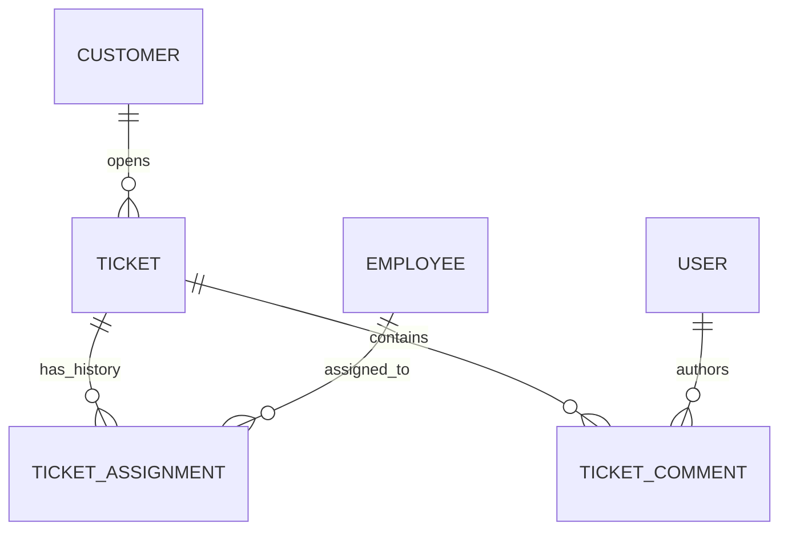

## Relationship Explanations
- Customer (1) -> (N) Ticket
- Ticket (1) -> (N) TicketAssignment
- Employee (1) -> (N) TicketAssignment (as assignee)
- Ticket (1) -> (N) TicketComment
- User (1) -> (N) TicketComment

## Ownership Rules
- Ticket belongs to Customer.
- TicketAssignment belongs to Ticket and references assignee Employee.
- TicketComment belongs to Ticket and author User.

## Deletion Behavior
- Ticket uses Soft Delete; Archive after retention period.
- TicketAssignment is Archive-only; assignment history must never be deleted.
- TicketComment uses Soft Delete with audit trace.

## Lifecycle Dependencies
- Ticket must be triaged before assignment.
- Only one TicketAssignment per Ticket may be Active at any time.
- Reassignment creates a new TicketAssignment and supersedes the prior one.
- SLA targets are determined at triage based on category and priority.

# Monitoring

## Mermaid ERD

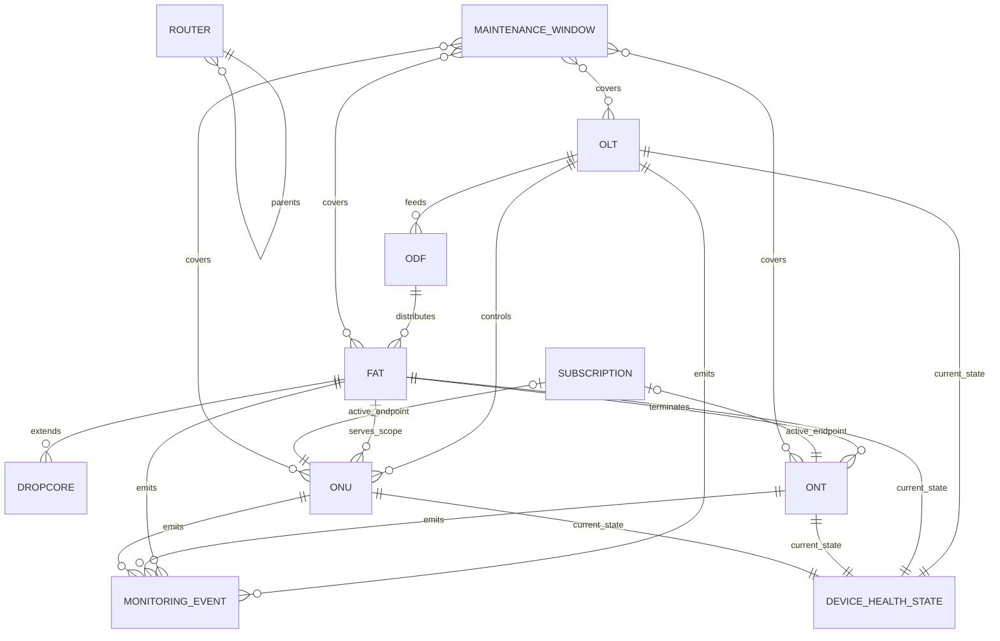

## Relationship Explanations
- Router (1) -> (N) Router (hierarchy via `parent_router_id`)
- OLT (1) -> (N) ODF
- ODF (1) -> (N) FAT
- FAT (1) -> (N) Dropcore
- FAT (1) -> (N) ONT
- OLT (1) -> (N) ONU
- FAT (0..1) -> (N) ONU
- Subscription (0..1) -> (1) active ONT endpoint
- Subscription (0..1) -> (1) active ONU endpoint
- OLT (1) -> (N) MonitoringEvent
- FAT (1) -> (N) MonitoringEvent
- ONT (1) -> (N) MonitoringEvent
- ONU (1) -> (N) MonitoringEvent
- OLT (1) -> (1) DeviceHealthState
- FAT (1) -> (1) DeviceHealthState
- ONT (1) -> (1) DeviceHealthState
- ONU (1) -> (1) DeviceHealthState
- MaintenanceWindow (N) -> (N) monitored assets via scope definition

## Ownership Rules
- Router belongs to itself as a self-referential topology aggregate.
- ODF belongs to OLT.
- FAT belongs to ODF.
- Dropcore belongs to FAT.
- ONT belongs to FAT.
- ONU belongs to OLT.
- ONU may optionally reference one FAT for downstream distribution scope.
- MonitoringEvent belongs to its source asset.

## Deletion Behavior
- OLT, ODF, FAT, ONT, ONU generally use Soft Delete with Restrict when active dependencies exist.
- Dropcore is typically Archive after replacement history closure.
- MonitoringEvent is Archive-only.
- DeviceHealthState uses Soft Delete when the associated device is archived.
- MaintenanceWindow is Archive after completion.

## Lifecycle Dependencies
- Physical topology registration precedes service activation.
- Monitoring events depend on active source assets.
- Health abstraction states (Healthy, Warning, Critical, Offline) depend on monitoring event processing.
- DeviceHealthState is derived from MonitoringEvent stream according to configured thresholds.
- MaintenanceWindow must be defined and activated before health signal suppression applies.

# Notifications

## Mermaid ERD

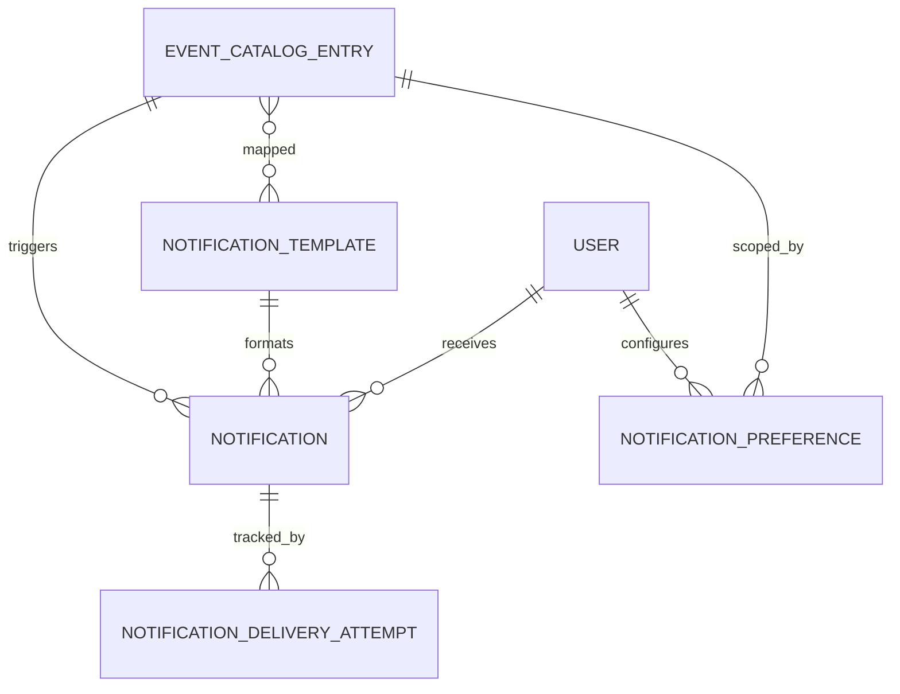

## Relationship Explanations
- EventCatalogEntry (1) -> (N) Notification
- NotificationTemplate (1) -> (N) Notification
- User (1) -> (N) Notification
- User (1) -> (N) NotificationPreference
- EventCatalogEntry (1) -> (N) NotificationPreference
- EventCatalogEntry (N) -> (N) NotificationTemplate
- Notification (1) -> (N) NotificationDeliveryAttempt

## Ownership Rules
- Notification belongs to EventCatalogEntry, NotificationTemplate, and recipient User.
- NotificationDeliveryAttempt belongs to Notification.
- NotificationPreference belongs to User and EventCatalogEntry.

## Deletion Behavior
- Notification is Archive after retention period.
- NotificationDeliveryAttempt is Archive after retention period.
- NotificationTemplate uses Soft Delete with Restrict if actively referenced.
- EventCatalogEntry uses Restrict when referenced.
- NotificationPreference uses Soft Delete.

## Lifecycle Dependencies
- EventCatalogEntry must be registered before notifications can be emitted.
- NotificationPreference is evaluated before channel delivery.
- NotificationDeliveryAttempt is created for each delivery attempt including retries and fallback channels.
- Notification queue processing is asynchronous and independent from primary business transaction completion.

# Attachments

## Mermaid ERD

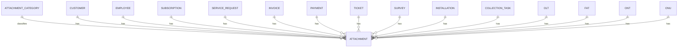

## Relationship Explanations
- AttachmentCategory (1) -> (N) Attachment
- Customer (1) -> (N) Attachment
- Employee (1) -> (N) Attachment
- Subscription (1) -> (N) Attachment
- ServiceRequest (1) -> (N) Attachment
- Invoice (1) -> (N) Attachment
- Payment (1) -> (N) Attachment
- Ticket (1) -> (N) Attachment
- Survey (1) -> (N) Attachment
- Installation (1) -> (N) Attachment
- CollectionTask (1) -> (N) Attachment
- OLT (1) -> (N) Attachment
- FAT (1) -> (N) Attachment
- ONT (1) -> (N) Attachment
- ONU (1) -> (N) Attachment

## Ownership Rules
- Attachment belongs to one owning entity context and one AttachmentCategory.
- Attachment access inherits ownership entity permissions.

## Deletion Behavior
- Attachment uses Soft Delete then delayed purge.
- AttachmentCategory uses Restrict when attachments exist.

## Lifecycle Dependencies
- Attachment processing may include image transform before active state.
- Physical file purge depends on retention and cleanup job completion.

# Audit

## Mermaid ERD

```mermaid
erDiagram
    USER ||--o{ ACTIVITY_LOG : performs
    USER ||--o{ TIMELINE_EVENT : acts_in
    USER ||--o{ STATE_TRANSITION_LOG : transitions
    CUSTOMER ||--o{ TIMELINE_EVENT : timeline_for
    SUBSCRIPTION ||--o{ TIMELINE_EVENT : timeline_for
    INVOICE ||--o{ TIMELINE_EVENT : timeline_for
    PAYMENT ||--o{ TIMELINE_EVENT : timeline_for
    TICKET ||--o{ TIMELINE_EVENT : timeline_for
    ONT ||--o{ TIMELINE_EVENT : timeline_for
    ONU ||--o{ TIMELINE_EVENT : timeline_for
    SURVEY ||--o{ TIMELINE_EVENT : timeline_for
    INSTALLATION ||--o{ TIMELINE_EVENT : timeline_for
    SUSPENSION_CASE ||--o{ TIMELINE_EVENT : timeline_for
    PROVISIONING_REQUEST ||--o{ TIMELINE_EVENT : timeline_for
    COLLECTION_TASK ||--o{ TIMELINE_EVENT : timeline_for
    MONITORING_EVENT ||--o{ TIMELINE_EVENT : timeline_for
    MAINTENANCE_WINDOW ||--o{ TIMELINE_EVENT : timeline_for
```

## Relationship Explanations
- User (1) -> (N) ActivityLog
- User (1) -> (N) TimelineEvent as actor
- User (1) -> (N) StateTransitionLog
- Customer (1) -> (N) TimelineEvent
- Subscription (1) -> (N) TimelineEvent
- Invoice (1) -> (N) TimelineEvent
- Payment (1) -> (N) TimelineEvent
- Ticket (1) -> (N) TimelineEvent
- ONT (1) -> (N) TimelineEvent
- ONU (1) -> (N) TimelineEvent
- Survey (1) -> (N) TimelineEvent
- Installation (1) -> (N) TimelineEvent
- SuspensionCase (1) -> (N) TimelineEvent
- ProvisioningRequest (1) -> (N) TimelineEvent
- CollectionTask (1) -> (N) TimelineEvent
- MonitoringEvent (1) -> (N) TimelineEvent
- MaintenanceWindow (1) -> (N) TimelineEvent

## Ownership Rules
- ActivityLog belongs to actor User and polymorphic target entity.
- TimelineEvent belongs to target entity and may reference actor User.
- StateTransitionLog is a polymorphic platform entity. It belongs to any lifecycle-managed entity (Subscription, Ticket, CollectionTask, ProvisioningRequest, etc.) and references the acting User.

## Deletion Behavior
- ActivityLog and StateTransitionLog are Archive-only.
- TimelineEvent is Soft Delete or Archive with audit trace.

## Lifecycle Dependencies
- Every controlled lifecycle transition creates StateTransitionLog.
- Human-readable timeline entries depend on event transformation from raw system actions.

# Settings

## Mermaid ERD

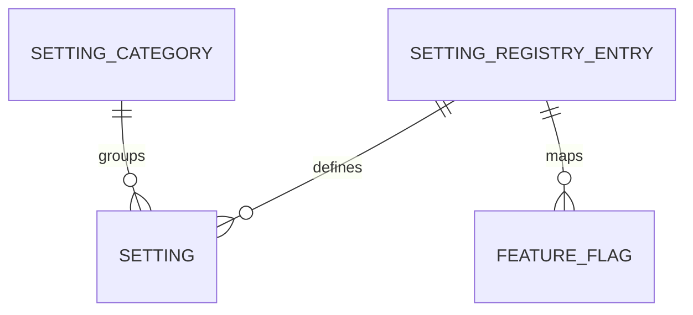

## Relationship Explanations
- SettingCategory (1) -> (N) Setting
- SettingRegistryEntry (1) -> (N) Setting across scopes
- SettingRegistryEntry (1) -> (N) FeatureFlag mappings

## Ownership Rules
- Setting belongs to SettingCategory and SettingRegistryEntry.
- FeatureFlag belongs to registered setting governance.

## Deletion Behavior
- Setting uses Soft Delete or Archive by governance context.
- SettingCategory uses Restrict when active settings exist.
- SettingRegistryEntry uses Restrict when in use.
- FeatureFlag uses Archive on retirement.

## Lifecycle Dependencies
- Setting keys must be registered before instance values are used.
- Typed validation depends on SettingRegistryEntry.
- Cache refresh depends on successful setting update events.

# Search

## Mermaid ERD

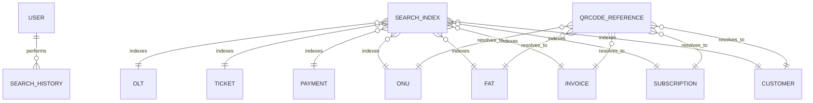

## Relationship Explanations
- User (1) -> (N) SearchHistory
- SearchIndex (N) -> (1) indexed source entity (polymorphic)
- QRCodeReference (N) -> (1) target entity (polymorphic)

## Ownership Rules
- SearchHistory belongs to User.
- SearchIndex belongs to a source entity reference and search subsystem.
- QRCodeReference belongs to a target entity mapping and QR governance policy.

## Deletion Behavior
- SearchHistory uses Soft Delete or TTL Archive.
- SearchIndex uses Cascade or rebuild cleanup when source entity changes.
- QRCodeReference uses Soft Delete and optional rotation Archive.

## Lifecycle Dependencies
- SearchIndex build depends on source entity create or update events.
- Search ranking depends on index freshness.
- QRCodeReference must resolve to an active target entity for successful lookup.

# Cross-Domain Relationship Summary

## Mermaid ERD

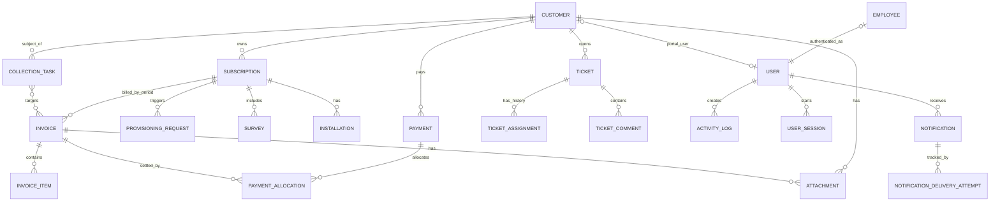

## Core Cardinality Examples
- Customer (1) -> (N) Invoice
- Invoice (1) -> (N) InvoiceItem
- Payment (1) -> (N) PaymentAllocation
- Customer (1) -> (1) Active Subscription
- Subscription (1) -> (N) Invoice
- Invoice (1) -> (N) PaymentAllocation
- Subscription (1) -> (N) Survey
- Subscription (1) -> (N) Installation
- Subscription (1) -> (N) ProvisioningRequest
- Customer (1) -> (N) CollectionTask
- CollectionTask (N) -> (N) Invoice through CollectionTaskInvoice
- Ticket (1) -> (N) TicketAssignment
- Notification (1) -> (N) NotificationDeliveryAttempt

## Ownership Rules (Global)
- Invoice belongs to Subscription and Customer.
- PaymentAllocation belongs to Payment and references Invoice.
- CollectionTask belongs to Customer; CollectionTaskInvoice references Invoice without owning it.
- ProvisioningRequest belongs to Subscription.
- TicketAssignment belongs to Ticket and references assignee Employee.
- ONT belongs to FAT.
- NotificationDeliveryAttempt belongs to Notification.
- Notification belongs to EventCatalogEntry and recipient User.
- Attachment belongs to one owner entity and one AttachmentCategory.
- Employee holds a mandatory FK to User (every employee has an authenticated identity).
- Customer holds an optional FK to User (only customers with portal access have a User account).

## Deletion Behavior (Global)
- Financial entities prioritize Restrict and logical immutability.
- Operational master entities use Soft Delete with Restrict on active dependencies.
- Event and audit style entities prefer Archive retention behavior.
- Attachment lifecycle uses Soft Delete then delayed purge.

## Lifecycle Dependencies (Global)
- Subscription activation precedes invoice generation.
- Survey completion precedes installation scheduling.
- Installation completion triggers provisioning request creation.
- Overdue invoice age drives suspension eligibility.
- Payment confirmation and allocation can unblock reactivation.
- CollectionTask does not alter invoice or payment ownership.
- TicketAssignment history is immutable once created.
- Monitoring events feed the business event system through EventCatalogEntry.
- NotificationDeliveryAttempt is created for each send attempt including retries and fallback channels.
- Settings registry validity precedes runtime settings usage.
